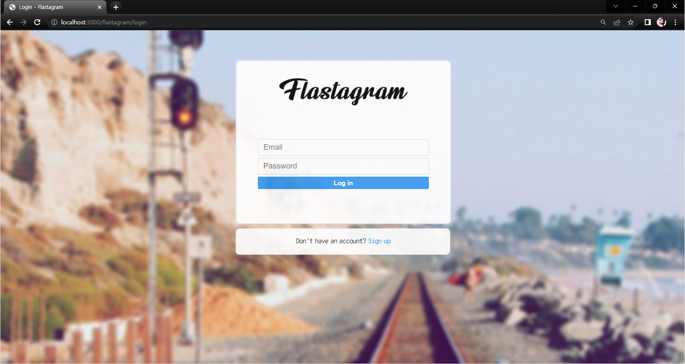
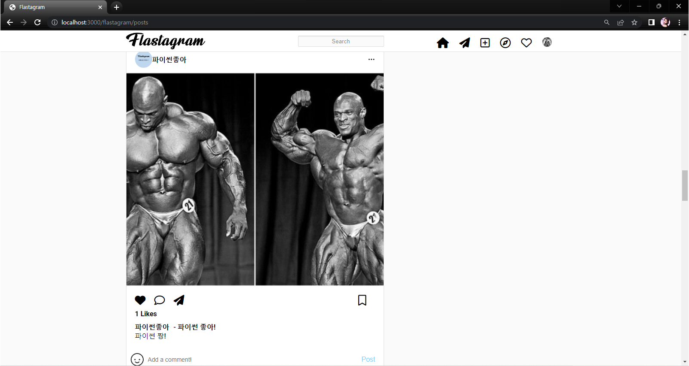
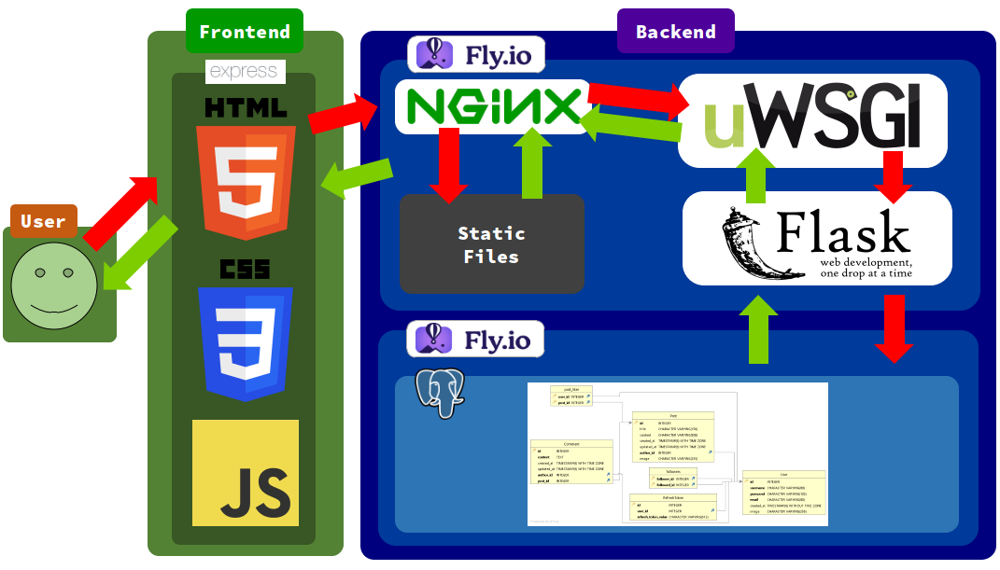
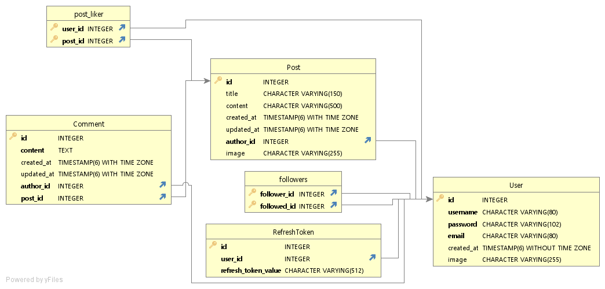

[![Forks][forks-shield]][forks-url]
[![Stargazers][stars-shield]][stars-url]
[![Issues][issues-shield]][issues-url]

<!-- PROJECT LOGO -->
 

  

  <h3 align="center">Flastagram - 인스타그램 클론코딩 with Flask</h3>

  

     
  

<!-- ABOUT THE PROJECT -->
## About Flastagram

Flask 웹 프레임워크로 간단한 HTTP API 서버를, Express.js 로 간단한 정적 서버를 구축하였습니다.

(<a href="#readme-top">back to top</a>)

## Architecture

### Cloud Architecture

### Backend API Specifications

<!--  -->

### Database ERD

(<a href="#readme-top">back to top</a>)

### Built With

#### Backend Stacks
![Python][Python-logo] ![Flask][Flask-logo]  
![PostgreSQL][PostgreSQL-logo] ![SQlite][SQlite-logo]  
![Docker][Docker-logo] ![Nginx][Nginx-logo] ![.env][.env-logo]  
  

#### Frontend Stacks
![HTML][HTML-logo] 
![CSS][CSS-logo]
![JS][JS-logo]  
![NodeJS][Nodejs-logo]
![Express][Express-logo]

(<a href="#readme-top">back to top</a>)

<!-- CONTACT -->
## Contact

TGoddessana - twicegoddessana1229@gmail.com
              (Feel free to reach out to me)

Project Link: https://github.com/TGoddessana/flastagram

(<a href="#readme-top">back to top</a>)

<!-- MARKDOWN LINKS & IMAGES -->
[Python-logo]: https://img.shields.io/badge/Python-3776AB?style=for-the-badge&logo=Python&logoColor=white
[Flask-logo]: https://img.shields.io/badge/Flask-000000?style=for-the-badge&logo=Flask&logoColor=white
[PostgreSQL-logo]: https://img.shields.io/badge/PostgreSQL-4169E1?style=for-the-badge&logo=PostgreSQL&logoColor=white
[Docker-logo]: https://img.shields.io/badge/Docker-2496ED?style=for-the-badge&logo=Docker&logoColor=white
[.env-logo]: https://img.shields.io/badge/.env-ECD53F?style=for-the-badge&logo=.envr&logoColor=white
[Nginx-logo]: https://img.shields.io/badge/nginx-009639?style=for-the-badge&logo=nginx&logoColor=white
[SQLite-logo]: https://img.shields.io/badge/sqlite-003B57?style=for-the-badge&logo=sqlite&logoColor=white

[HTML-logo]: https://img.shields.io/badge/html5-E34F26?style=for-the-badge&logo=html5&logoColor=white
[JS-logo]: https://img.shields.io/badge/Javascript-F7DF1E?style=for-the-badge&logo=javascript&logoColor=white
[CSS-logo]: https://img.shields.io/badge/css3-1572B6?style=for-the-badge&logo=css3&logoColor=white
[NodeJS-logo]: https://img.shields.io/badge/node.js-339933?style=for-the-badge&logo=node&logoColor=white
[Express-logo]: https://img.shields.io/badge/express.js-000000?style=for-the-badge&logo=express&logoColor=white

[forks-shield]: https://img.shields.io/github/forks/tgoddessana/flastagram?style=for-the-badge
[forks-url]: https://github.com/tgoddessana/flastagram/network/members
[stars-shield]: https://img.shields.io/github/stars/tgoddessana/flastagram.svg?style=for-the-badge
[stars-url]: https://github.com/tgoddessana/flastagram/stargazers
[issues-shield]: https://img.shields.io/github/issues/tgoddessana/flastagram.svg?style=for-the-badge
[issues-url]: https://github.com/tgoddessana/flastagram/issues

